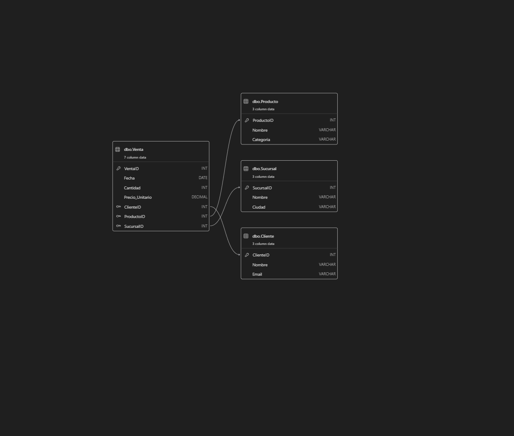
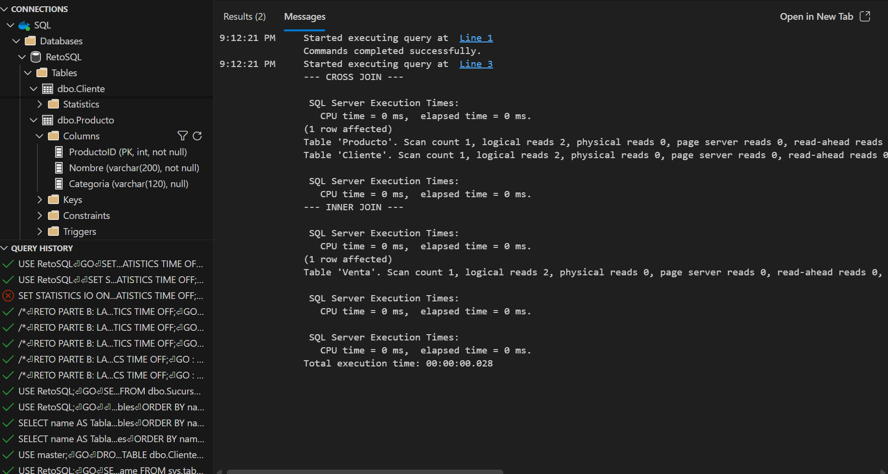

# Reporte Técnico  
## Reto SQL – Diseño Relacional y Performance

**Estudiante:** JOSUE PEDRAZA GARCIA  
**Fecha:** 21/01/2026 

---

## 1. Introducción

El presente reporte documenta el diseño de un esquema relacional normalizado y un laboratorio de performance en SQL Server, a partir del archivo `raw_sales_dump.csv`.  
El objetivo es demostrar la correcta aplicación de la Tercera Forma Normal (3FN) y evidenciar el impacto del uso de `CROSS JOIN` frente a `INNER JOIN` mediante métricas de I/O.

---

## 2. Diseño del Esquema Relacional (Parte A)

### 2.1 Análisis del archivo fuente

El archivo CSV contiene información relacionada con:
- Clientes (nombre, correo)
- Productos (nombre, categoría)
- Sucursales (nombre, ciudad)
- Ventas (fecha, cantidad, precio)

Estos grupos corresponden a entidades distintas del mundo real.

---

### 2.2 Modelo normalizado (3FN)

Siguiendo principios de normalización:

- Se crearon tablas maestras para **Cliente**, **Producto** y **Sucursal**
- Se creó una tabla transaccional **Venta**
- Se eliminaron redundancias almacenando texto una sola vez
- La tabla Venta contiene únicamente métricas y llaves foráneas

**Tablas creadas:**
- Cliente(ClienteID, Nombre, Email)
- Producto(ProductoID, Nombre, Categoria)
- Sucursal(SucursalID, Nombre, Ciudad)
- Venta(VentaID, Fecha, Cantidad, Precio_Unitario, ClienteID, ProductoID, SucursalID)

Todas las tablas cuentan con **PRIMARY KEY** y las relaciones están definidas mediante **FOREIGN KEY**, garantizando integridad referencial.

---

### 2.3 Diagrama Entidad–Relación (DER)




El diagrama evidencia:
- Relaciones 1–N entre Cliente–Venta, Producto–Venta y Sucursal–Venta
- Separación clara entre dimensiones y tabla de hechos

---

## 3. Laboratorio de Performance (Parte B)

### 3.1 Objetivo

Comparar el impacto en rendimiento entre:
- Un `CROSS JOIN` (producto cartesiano)
- Un `INNER JOIN` basado en llaves foráneas

---

### 3.2 Configuración de medición

Se activaron las siguientes opciones en SQL Server:

```sql
SET STATISTICS IO ON;
SET STATISTICS TIME ON;
```
---
### 3.3 Resultados obtenidos

#### CROSS JOIN
- Filas retornadas: **240**
- Corresponde a la combinación cartesiana entre 20 clientes y 12 productos.
- Logical Reads:
  - Tabla Cliente: 2
  - Tabla Producto: 2

#### INNER JOIN
- Filas retornadas: **200**
- Corresponde a ventas reales registradas en el sistema.
- Logical Reads:
  - Tabla Venta: 2



---

### 3.4 Análisis de resultados

El `CROSS JOIN` genera un producto cartesiano que combina todas las filas de las tablas involucradas, aun cuando no exista una relación real entre los datos. Esto provoca un crecimiento multiplicativo del número de filas retornadas, lo que representa un riesgo significativo en términos de rendimiento en escenarios de gran volumen de datos.

El `INNER JOIN`, en contraste, utiliza las llaves foráneas definidas en la tabla `Venta` para unir únicamente registros existentes, evitando combinaciones innecesarias. Aunque el dataset utilizado es reducido y los costos de I/O son bajos, la diferencia estructural es clara. En entornos productivos con millones de registros, el uso de `CROSS JOIN` incrementa de forma considerable el consumo de CPU, memoria y lecturas lógicas, mientras que el `INNER JOIN` escala de forma controlada.

---

## 4. Conclusiones

- El esquema relacional implementado cumple con la Tercera Forma Normal (3FN).
- La normalización reduce la redundancia y mejora la integridad de los datos.
- El laboratorio de performance evidencia los riesgos asociados al uso de `CROSS JOIN`.
- El uso adecuado de `INNER JOIN` permite consultas más eficientes y escalables.

---

## 5. Evidencias

- Script de diseño del esquema: `02_sql/1_ddl_diseno/solution_schema.sql`
- Script del laboratorio de performance: `02_sql/2_performance_lab/solution_tuning.sql`
- Capturas de pantalla de STATISTICS IO y STATISTICS TIME
